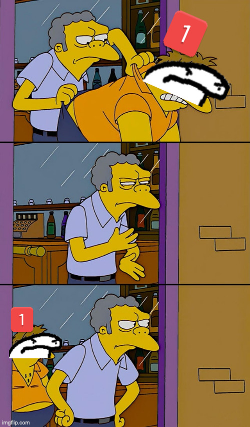

# Perjantaipingi

Tervehdys koodiklinikkalainen!

Olet saattanut törmätä tai saatat törmätä tulevaisuudessa klinikalla keskusteluun **Perjantaipingistä**. Jos tämä sisäpiirijuttu herättää kiinnostusta ja mietit mistäköhän on kyse, olet löytänyt vallan oikeaan paikkaan.

Perjantaipingiä voi tavata luonnossa eri varianteissaan:

<figure><figcaption>
Eri perjantaipingi-variantteja
</figcaption></figure>

Tarina Perjantaipingin taustalla alkaa alkusyksystä 2021, kun herättelimme henkiin Koodiklinikalla aiempina vuosina pyöritettyä palkkakyselyä. Eräänä kauniina syysperjantaisena päivänä, allekirjoittanut eli Juhis, koki hyväksi ideaksi saavuttaa yhteisön kyselylle suurempaa tietoisuutta käyttämällä `@channel` -kanavapingiä.

Sen lisäksi että Koodiklinikalle saapui viestiä ihastelemaan moni, joka ei aktiivisesti viettänyt kanavilla aikaa, se aiheutti myös osassa käyttäjäkuntaa vähemmän mairittelevan reaktion ja sai aikaan ns. paskamyrskyn, kun näkemykset siitä milloin on soveltuvaa käyttää pingiä ja milloin ei erosivat merkittävästi.

Suurinta tunnekuohua lievittämään saatiin onneksi tarjouskuponkeja pizzeriaan erään käyttäjän hankkimana, joten usein Perjantaipingistä puhuttaessa vilahtelee myös erinäisiä pizza-viittauksia.

Vuoden mittaan Perjantaipingi alkoi muotoutua omaksi käsitteekseen erityisesti sen oman emojin kautta ja syksyllä 2022 palkkakyselyn alla asiasta jo vitsailtiin ja saattoi joku käyttäjä odottaa Perjantaipingiä kuin joulupukkia pikkulapsena.

Nykyään Perjantaipingi-emojia eri varianteissaan tulee vastaan hieman siellä sun täällä, toivottavasti pääosin positiivisessa hengessä. Se on myös hieno esimerkki siitä, miten negatiivinen kokemus voidaan yhteisössä kääntää positiiviseksi sisäpiirivitsiksi ja osaksi kansanperinnettä.&#x20;

### Perjantaipingimeemejä:

Vuosien varrella on syntynyt aiheen ympärille myös omaa meemikulttuuria.

.jpg>)

.png>)
