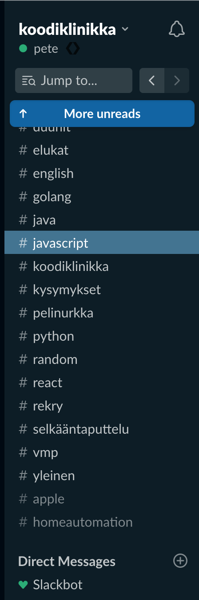
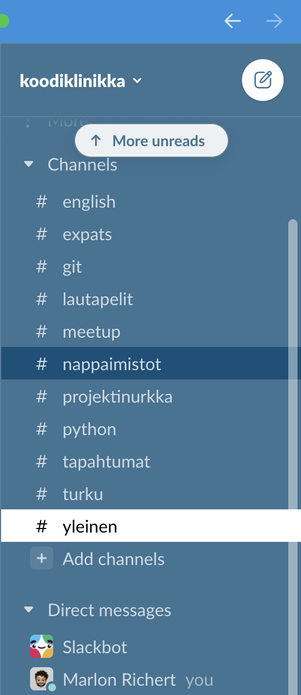

# Slack-teema

Tässäpä Slack-teema Koodiklinikka-fiilistä luomaan, katso [ohjeista](https://slack.com/intl/en-fi/help/articles/205166337-Change-your-Slack-theme) kuinka otat sen käyttöön.

| Dark | Light |
| :--- | :--- |
| \#0C1D26,\#295D7B,\#437491,\#FFFFFF,\#3D6964,\#FFFFFF,\#2BAC76,\#8BC5BF | \#085078,\#121016,\#FCFCFC,\#000000,\#3E7394,\#FFFFFF,\#85D8CE,\#85D8CE,\#3090DE,\#FFFFFF |
|  |  |

